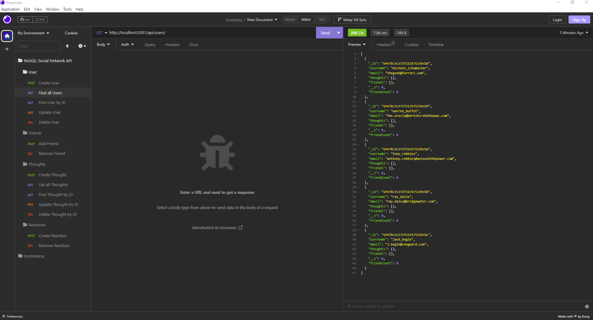
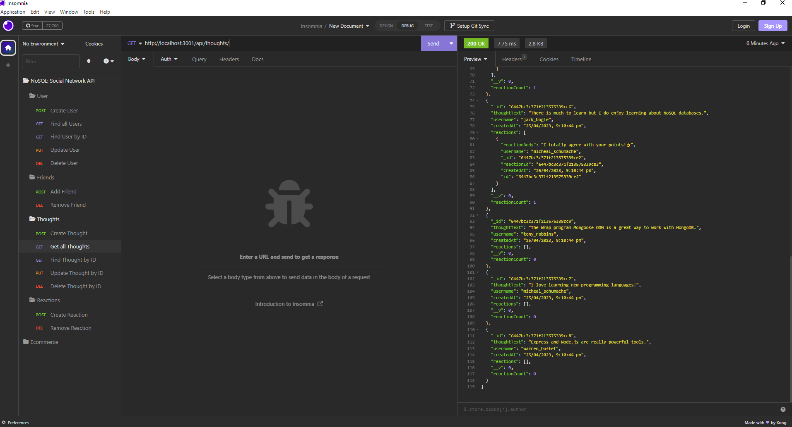
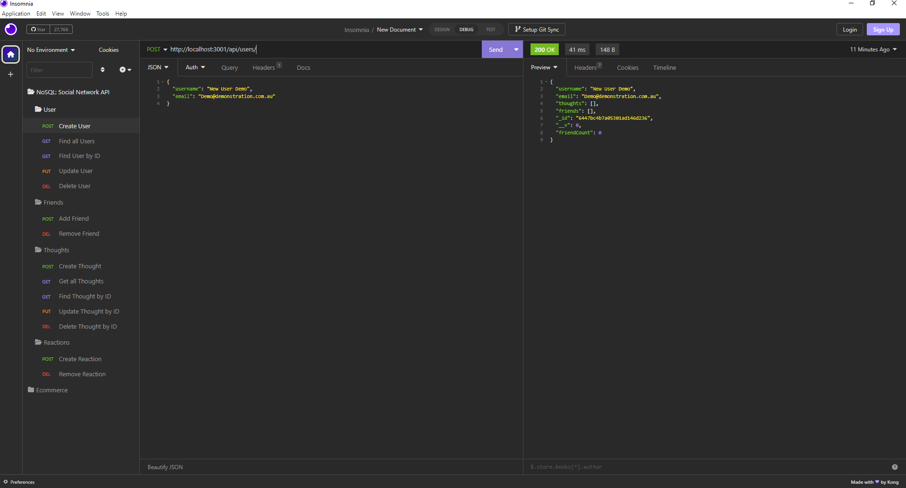
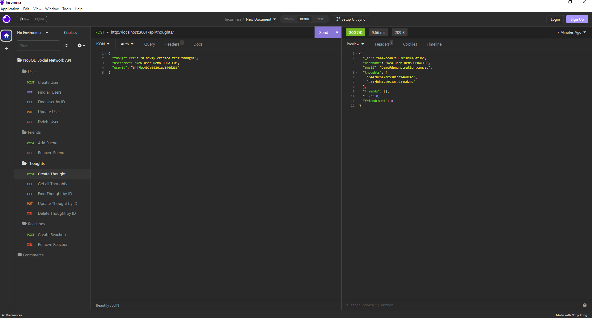
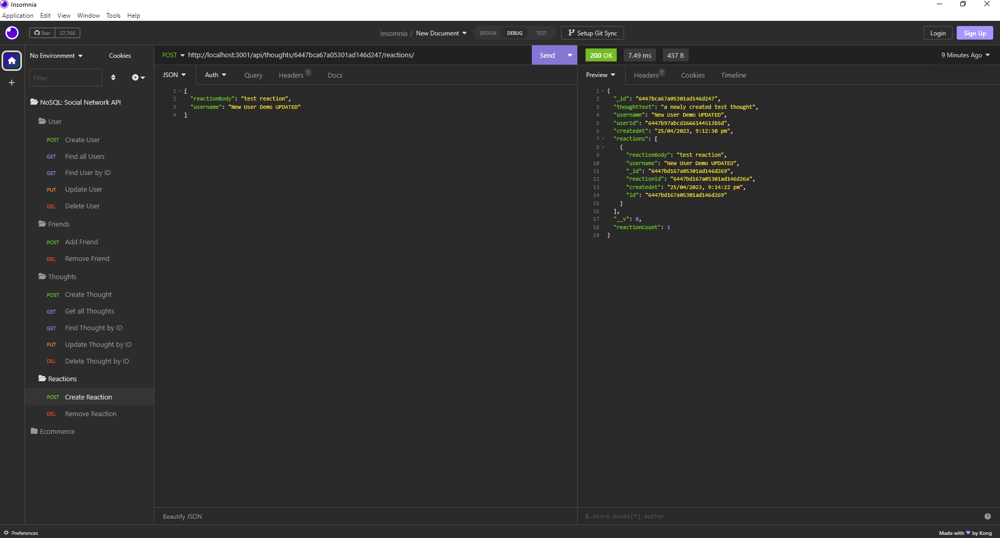

# Ben-Armstrong-NoSQL-Social-Network-API

## Your Task

MongoDB is a popular choice for many social networks due to its speed with large amounts of data and flexibility with unstructured data. Over the last part of this course, you’ll use several of the technologies that social networking platforms use in their full-stack applications. Because the foundation of these applications is data, it’s important that you understand how to build and structure the API first.

Your Challenge is to build an API for a social network web application where users can share their thoughts, react to friends’ thoughts, and create a friend list. You’ll use Express.js for routing, a MongoDB database, and the Mongoose ODM. In addition to using the [Express.js](https://www.npmjs.com/package/express) and [Mongoose](https://www.npmjs.com/package/mongoose) packages, you may also optionally use a JavaScript date library of your choice or the native JavaScript `Date` object to format timestamps.

No seed data is provided, so you’ll need to create your own data using Insomnia after you’ve created your API.

Because this application won’t be deployed, you’ll also need to create a walkthrough video that demonstrates its functionality and all of the following acceptance criteria being met. You’ll need to submit a link to the video and add it to the README of your project.

## User Story

```md
AS A social media startup
I WANT an API for my social network that uses a NoSQL database
SO THAT my website can handle large amounts of unstructured data
```

## Acceptance Criteria

```md
GIVEN a social network API
WHEN I enter the command to invoke the application
THEN my server is started and the Mongoose models are synced to the MongoDB database
WHEN I open API GET routes in Insomnia for users and thoughts
THEN the data for each of these routes is displayed in a formatted JSON
WHEN I test API POST, PUT, and DELETE routes in Insomnia
THEN I am able to successfully create, update, and delete users and thoughts in my database
WHEN I test API POST and DELETE routes in Insomnia
THEN I am able to successfully create and delete reactions to thoughts and add and remove friends to a user’s friend list
```

## Grading Requirements
* Your GitHub repository containing your application code.
* A walkthrough video that demonstrates the functionality of the social media API must be submitted, and a link to the video should be included in your README file.
* The walkthrough video must show all of the technical acceptance criteria being met.
* The walkthrough video must demonstrate how to start the application’s server.
* The walkthrough video must demonstrate GET routes for all users and all thoughts being tested in Insomnia.
* The walkthrough video must demonstrate GET routes for a single user and a single thought being tested in Insomnia.
* The walkthrough video must demonstrate POST, PUT, and DELETE routes for users and thoughts being tested in Insomnia.
* Walkthrough video must demonstrate POST and DELETE routes for a user’s friend list being tested in Insomnia.
* Walkthrough video must demonstrate POST and DELETE routes for reactions to thoughts being tested in Insomnia.
* Uses the [Mongoose package](https://www.npmjs.com/package/mongoose) to connect to a MongoDB database.
* Includes User and Thought models outlined in the Challenge instructions.
* Includes schema settings for User and Thought models as outlined in the Challenge instructions.
* Includes Reactions as the `reaction` field's subdocument schema in the Thought model.
* Uses functionality to format queried timestamps properly.
* Repository has a unique name.
* Repository follows best practices for file structure and naming conventions.
* Repository follows best practices for class/id naming conventions, indentation, quality comments, etc.
* Repository contains multiple descriptive commit messages.
* Repository contains a high-quality README with description and a link to a walkthrough video.
### Bonus: +10 Points
* Application deletes a user's associated thoughts when the user is deleted.

## Table of Content
* [Credits](#credits)
* [What-I-Learned](#what-i-learned)
* [Installation](#installation)
* [Usage](#usage)
* [Made-With](#made-with)
* [License](#license)

# Credits
* Ben Armstrong https://github.com/BenArmstrong81 <br>

*With special thanks to The University of Adelaide Full Stack Web Development Class.*

# What-I-Learned
Building on the two thirds of the course and extending on from the last couple weeks using Node.js we learnt how to incororate MongoDB (NoSQL) along with Mongoose. The modules in class included but not limited to; MongoDB, Mongoose, Virtuals, CRUD, Subdocuments, Models, Aggregates.

# Installation  

```
npm install
```

# Usage
To view this application,the following image shows the landing page of the application, or click on the page link that demonstrates the functionality of this project: <https://drive.google.com/file/d/1EOsd6Ku0YDq7rSSorPgvKGMy1k4rfGYe/view?usp=sharing>

All users of this application:


All thoughts of this application:


Create a new user:


Create a new thought for a user:


Create a new reaction for a thought:


# Made-With


  
 

# License

Please refer to the LICENSE in the repo. <br/>
